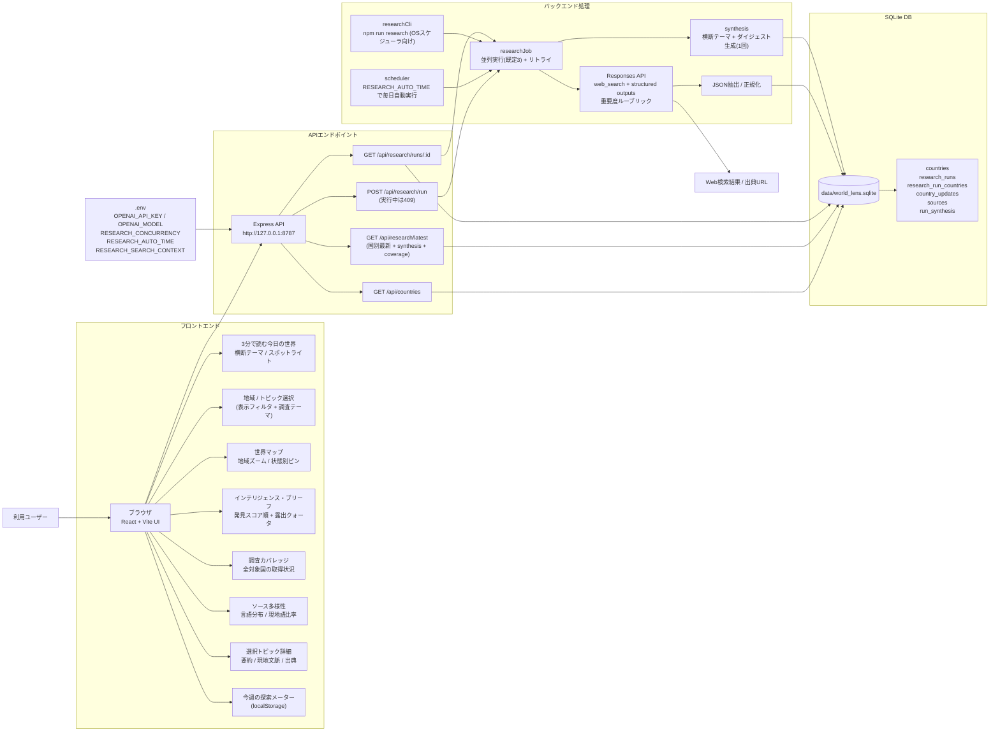

# World Lens システム図

## データの流れ

1. ユーザーが地域・トピックを選び、AIリサーチを開始します(または `RESEARCH_AUTO_TIME` / `npm run research` による自動実行)。
2. Express が国別リサーチジョブを並列(既定3並列)で開始します。多重実行は 409 で防止します。
3. 各国について Responses API + `web_search` が主要トピック、要約、重要理由、現地文脈、出典を生成します。structured outputs で形式を保証し、失敗時は従来方式で1回リトライします。
4. 全国の完了後、結果を1回のLLM呼び出しで統合し、「今日の世界ダイジェスト」と複数国にまたがる横断テーマを生成します(`run_synthesis`)。
5. UI は実行中も `GET /api/research/latest` をポーリングし、完了した国から地図・ブリーフへ順次反映します。
6. 表示は「国ごとの最後に成功した結果」を使うため、あるランで取得に失敗した国も過去データが残ります。前回ランとの比較で「新規 / 継続」を判定します。

## 偏り是正の仕組み

- **発見スコア** = importance_score × 露出補正(anchor 1.0 / regional 1.2 / rare 1.5)。並び順に適用。
- **露出クォータ**: ブリーフ上位8件に rare 国を最低2件確保(データがある場合)。
- **重要度ルーブリック**: 「国の大きさではなく変化の大きさ」を全国共通の基準で採点するようプロンプトで統一。
- **ソース多様性の計測**: 出典の言語を正規化し、国別の現地語定義(`shared/language.ts`)と照合して現地語比率を算出・表示。
