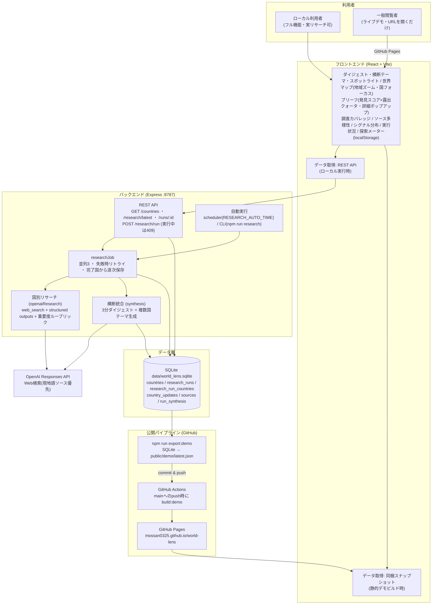

# World Lens システム図

## データの流れ

### ローカル実行(フル機能)

1. ユーザーが「AIリサーチ開始」を押す(または scheduler / CLI による自動実行)。多重実行は 409 で防止。
2. `researchJob` が対象国を並列3で調査。各国は Responses API + `web_search` で主要トピック・要約・現地文脈・出典を生成(structured outputs で形式保証、失敗時は従来方式で1回リトライ)。
3. 完了した国から SQLite に保存され、UI は `/api/research/latest` のポーリングで逐次反映する。
4. 全国完了後、結果を1回のLLM呼び出しで統合し「3分ダイジェスト」と複数国にまたがる横断テーマを生成(`run_synthesis`)。
5. 表示は「国ごとの最後に成功した結果」を使うため、失敗した国も過去データが残る。前回ランとの比較で「新規 / 継続」を判定。

### 静的デモ(GitHub Pages)

1. `npm run export:demo` が SQLite から `/api/research/latest` 相当のJSON(`public/demo/latest.json`)を書き出す。
2. `main` へ push すると GitHub Actions が `build:demo`(`vite --mode staticdemo`)を実行し Pages へデプロイ。
3. デモビルドのフロントエンドはAPIの代わりに同梱スナップショットを読み、リサーチ実行以外の全機能が動く。

## 偏り是正の仕組み

- **発見スコア** = importance_score × 露出補正(anchor 1.0 / regional 1.2 / rare 1.5)。並び順に適用。
- **露出クォータ**: ブリーフ上位8件に rare 国を最低2件確保(データがある場合)。
- **重要度ルーブリック**: 「国の大きさではなく変化の大きさ」を全国共通の基準で採点するようプロンプトで統一。
- **ソース多様性の計測**: 出典の言語を正規化し、国別の現地語定義(`shared/language.ts`)と照合して現地語比率を算出・表示。
- **スポットライト/探索メーター**: 報道の少ない国の日替わり紹介と、閲覧国数の可視化で受動的な発見を促す。
